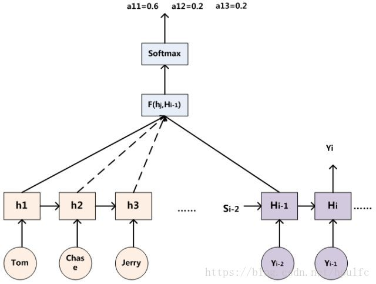

## 目录
- [目录](#目录)
- [1. 什么是Attention机制](#1-什么是attention机制)
- [2. 编解码器中的Attention](#2-编解码器中的attention)
  - [2.1 计算背景变量](#21-计算背景变量)
  - [2.2 更新隐藏状态](#22-更新隐藏状态)
- [3. Attention本质](#3-attention本质)
  - [3.1 机器翻译说明Attention](#31-机器翻译说明attention)
  - [3.2 注意力分配概率计算](#32-注意力分配概率计算)
  - [3.3 Attention的物理含义](#33-attention的物理含义)
- [4. Self-Attention模型](#4-self-attention模型)
- [5. 发展](#5-发展)
- [6. 代码实现](#6-代码实现)
- [7. 参考文献](#7-参考文献)

## 1. 什么是Attention机制

在“编码器—解码器（seq2seq）”⼀节⾥，解码器在各个时间步依赖相同的背景变量来获取输⼊序列信息。当编码器为循环神经⽹络时，背景变量来⾃它最终时间步的隐藏状态。

现在，让我们再次思考那⼀节提到的翻译例⼦：输⼊为英语序列“They”“are”“watching”“.”，输出为法语序列“Ils”“regardent”“.”。不难想到，解码器在⽣成输出序列中的每⼀个词时可能只需利⽤输⼊序列某⼀部分的信息。例如，在输出序列的时间步1，解码器可以主要依赖“They”“are”的信息来⽣成“Ils”，在时间步2则主要使⽤来⾃“watching”的编码信息⽣成“regardent”，最后在时间步3则直接映射句号“.”。**这看上去就像是在解码器的每⼀时间步对输⼊序列中不同时间步的表征或编码信息分配不同的注意⼒⼀样。这也是注意⼒机制的由来。**

**仍然以循环神经⽹络为例，注意⼒机制通过对编码器所有时间步的隐藏状态做加权平均来得到背景变量。解码器在每⼀时间步调整这些权重，即注意⼒权重，从而能够在不同时间步分别关注输⼊序列中的不同部分并编码进相应时间步的背景变量。**

在注意⼒机制中，解码器的每⼀时间步将使⽤可变的背景变量。记 ct′ 是解码器在时间步 t′ 的背景变量，那么解码器在该时间步的隐藏状态可以改写为：

这⾥的关键是如何计算背景变量 ct′ 和如何利⽤它来更新隐藏状态 st′。下⾯将分别描述这两个关键点。

## 2. 编解码器中的Attention

### 2.1 计算背景变量

我们先描述第⼀个关键点，即计算背景变量。下图描绘了注意⼒机制如何为解码器在时间步 2 计算背景变量。

1. 函数 a 根据解码器在时间步 1 的隐藏状态和编码器在各个时间步的隐藏状态计算softmax运算的输⼊。
2. softmax运算输出概率分布并对编码器各个时间步的隐藏状态做加权平均，从而得到背景变量。

令编码器在时间步t的隐藏状态为 ht，且总时间步数为 T。那么解码器在时间步 t′ 的背景变量为所有编码器隐藏状态的加权平均：

**矢量化计算背景变量**

我们还可以对注意⼒机制采⽤更⾼效的⽮量化计算。我们先定义，在上⾯的例⼦中，查询项为解码器的隐藏状态，键项和值项均为编码器的隐藏状态。

⼴义上，注意⼒机制的输⼊包括查询项以及⼀⼀对应的键项和值项，其中值项是需要加权平均的⼀组项。在加权平均中，值项的权重来⾃查询项以及与该值项对应的键项的计算。

让我们考虑⼀个常⻅的简单情形，即编码器和解码器的隐藏单元个数均为 h，且函数 $a(s,h)=s^Th$ 。假设我们希望根据解码器单个隐藏状态 st′−1 和编码器所有隐藏状态 ht, t = 1, . . . , T来计算背景向量 ct′ 。我们可以将查询项矩阵 Q 设为，并令键项矩阵 K 和值项矩阵 V 相同且第 t ⾏均为 $h_t^T$ 。此时，我们只需要通过⽮量化计算：

$$
softmax(QK^T)V
$$

即可算出转置后的背景向量。当查询项矩阵 Q 的⾏数为 n 时，上式将得到 n ⾏的输出矩阵。输出矩阵与查询项矩阵在相同⾏上⼀⼀对应。

### 2.2 更新隐藏状态

现在我们描述第⼆个关键点，即更新隐藏状态。以⻔控循环单元为例，在解码器中我们可以对⻔控循环单元（GRU）中⻔控循环单元的设计稍作修改，从而变换上⼀时间步 t′−1 的输出 yt′−1、隐藏状态 st′−1 和当前时间步t′ 的含注意⼒机制的背景变量 ct′。解码器在时间步 t’ 的隐藏状态为：

其中的重置⻔、更新⻔和候选隐藏状态分别为：

其中含下标的 W 和 b 分别为⻔控循环单元的权重参数和偏差参数。

## 3. Attention本质

### 3.1 机器翻译说明Attention

本节先以机器翻译作为例子讲解最常见的Soft Attention模型的基本原理，之后抛离Encoder-Decoder框架抽象出了注意力机制的本质思想。

如果拿机器翻译来解释这个Encoder-Decoder框架更好理解，比如输入的是英文句子：Tom chase Jerry，Encoder-Decoder框架逐步生成中文单词：“汤姆”，“追逐”，“杰瑞”。

在翻译“杰瑞”这个中文单词的时候，模型里面的每个英文单词对于翻译目标单词“杰瑞”贡献是相同的，很明显这里不太合理，**显然“Jerry”对于翻译成“杰瑞”更重要，但是模型是无法体现这一点的，这就是为何说它没有引入注意力的原因。**

没有引入注意力的模型在输入句子比较短的时候问题不大，但是如果输入句子比较长，此时所有语义完全通过一个中间语义向量来表示，单词自身的信息已经消失，可想而知会丢失很多细节信息，这也是为何要引入注意力模型的重要原因。

上面的例子中，如果引入Attention模型的话，应该在翻译“杰瑞”的时候，体现出英文单词对于翻译当前中文单词不同的影响程度，比如给出类似下面一个概率分布值：

（Tom,0.3）(Chase,0.2) (Jerry,0.5)

**每个英文单词的概率代表了翻译当前单词“杰瑞”时，注意力分配模型分配给不同英文单词的注意力大小。** 这对于正确翻译目标语单词肯定是有帮助的，因为引入了新的信息。

同理，目标句子中的每个单词都应该学会其对应的源语句子中单词的注意力分配概率信息。这意味着在生成每个单词yi的时候，原先都是相同的中间语义表示C会被替换成根据当前生成单词而不断变化的Ci。理解Attention模型的关键就是这里，即由固定的中间语义表示C换成了根据当前输出单词来调整成加入注意力模型的变化的Ci。增加了注意力模型的Encoder-Decoder框架理解起来如下图所示。

每个Ci可能对应着不同的源语句子单词的注意力分配概率分布，比如对于上面的英汉翻译来说，其对应的信息可能如下：

其中，f2函数代表Encoder对输入英文单词的某种变换函数，比如如果Encoder是用的RNN模型的话，这个f2函数的结果往往是某个时刻输入xi后隐层节点的状态值；g代表Encoder根据单词的中间表示合成整个句子中间语义表示的变换函数，一般的做法中，g函数就是对构成元素加权求和，即下列公式：

$$
C_i=\sum_{j=1}^{L_x}a_{ij}h_j
$$

其中，Lx代表输入句子Source的长度，aij代表在Target输出第i个单词时Source输入句子中第j个单词的注意力分配系数，而hj则是Source输入句子中第j个单词的语义编码。假设下标i就是上面例子所说的“ 汤姆” ，那么Lx就是3，h1=f(“Tom”)，h2=f(“Chase”),h3=f(“Jerry”)分别是输入句子每个单词的语义编码，对应的注意力模型权值则分别是0.6,0.2,0.2，所以g函数本质上就是个加权求和函数。

### 3.2 注意力分配概率计算

这里还有一个问题：生成目标句子某个单词，比如“汤姆”的时候，如何知道Attention模型所需要的输入句子单词注意力分配概率分布值呢？就是说“汤姆”对应的输入句子Source中各个单词的概率分布：(Tom,0.6)(Chase,0.2) (Jerry,0.2) 是如何得到的呢？

对于采用RNN的Decoder来说，在时刻i，如果要生成yi单词，我们是可以知道Target在生成Yi之前的时刻i-1时，隐层节点i-1时刻的输出值Hi-1的，而我们的目的是要计算生成Yi时输入句子中的单词“Tom”、“Chase”、“Jerry”对Yi来说的注意力分配概率分布，那么可以用Target输出句子i-1时刻的隐层节点状态Hi-1去一一和输入句子Source中每个单词对应的RNN隐层节点状态hj进行对比，即通过函数F(hj,Hi-1)来获得目标单词yi和每个输入单词对应的对齐可能性，这个F函数在不同论文里可能会采取不同的方法，然后函数F的输出经过Softmax进行归一化就得到了符合概率分布取值区间的注意力分配概率分布数值。

### 3.3 Attention的物理含义

一般在自然语言处理应用里会把Attention模型看作是输出Target句子中某个单词和输入Source句子每个单词的对齐模型，这是非常有道理的。

**目标句子生成的每个单词对应输入句子单词的概率分布可以理解为输入句子单词和这个目标生成单词的对齐概率，** 这在机器翻译语境下是非常直观的：传统的统计机器翻译一般在做的过程中会专门有一个短语对齐的步骤，而注意力模型其实起的是相同的作用。

如果把Attention机制从上文讲述例子中的Encoder-Decoder框架中剥离，并进一步做抽象，可以更容易看懂Attention机制的本质思想。

我们可以这样来看待Attention机制（参考图9）：将Source中的构成元素想象成是由一系列的<Key,Value>数据对构成，此时给定Target中的某个元素Query，通过计算Query和各个Key的相似性或者相关性，得到每个Key对应Value的权重系数，然后对Value进行加权求和，即得到了最终的Attention数值。所以本质上Attention机制是对Source中元素的Value值进行加权求和，而Query和Key用来计算对应Value的权重系数。即可以将其本质思想改写为如下公式：

$$
Attention(Query,Source)=\sum_{i=1}^{L_x}Similarity(Query,key_i)*Value_i
$$

其中，Lx=||Source||代表Source的长度，公式含义即如上所述。上文所举的机器翻译的例子里，因为在计算Attention的过程中，Source中的Key和Value合二为一，指向的是同一个东西，也即输入句子中每个单词对应的语义编码，所以可能不容易看出这种能够体现本质思想的结构。

至于Attention机制的具体计算过程，如果对目前大多数方法进行抽象的话，可以将其归纳为两个过程：第一个过程是根据Query和Key计算权重系数，第二个过程根据权重系数对Value进行加权求和。而第一个过程又可以细分为两个阶段：第一个阶段根据Query和Key计算两者的相似性或者相关性；第二个阶段对第一阶段的原始分值进行归一化处理；

## 4. Self-Attention模型

Self Attention也经常被称为intra Attention（内部Attention），最近一年也获得了比较广泛的使用，比如Google最新的机器翻译模型内部大量采用了Self Attention模型。

在一般任务的Encoder-Decoder框架中，输入Source和输出Target内容是不一样的，比如对于英-中机器翻译来说，Source是英文句子，Target是对应的翻译出的中文句子，Attention机制发生在Target的元素Query和Source中的所有元素之间。**而Self Attention顾名思义，指的不是Target和Source之间的Attention机制，而是Source内部元素之间或者Target内部元素之间发生的Attention机制，也可以理解为Target=Source这种特殊情况下的注意力计算机制。** 其具体计算过程是一样的，只是计算对象发生了变化而已，所以此处不再赘述其计算过程细节。

很明显，引入Self Attention后会更容易捕获句子中长距离的相互依赖的特征，因为如果是RNN或者LSTM，需要依次序序列计算，对于远距离的相互依赖的特征，要经过若干时间步步骤的信息累积才能将两者联系起来，而距离越远，有效捕获的可能性越小。

但是Self Attention在计算过程中会直接将句子中任意两个单词的联系通过一个计算步骤直接联系起来，所以远距离依赖特征之间的距离被极大缩短，有利于有效地利用这些特征。除此外，Self Attention对于增加计算的并行性也有直接帮助作用。这是为何Self Attention逐渐被广泛使用的主要原因。

## 5. 发展

本质上，注意⼒机制能够为表征中较有价值的部分分配较多的计算资源。这个有趣的想法⾃提出后得到了快速发展，特别是启发了依靠注意⼒机制来编码输⼊序列并解码出输出序列的**变换器（Transformer）模型**的设计。变换器抛弃了卷积神经⽹络和循环神经⽹络的架构。它在计算效率上⽐基于循环神经⽹络的编码器—解码器模型通常更具明显优势。含注意⼒机制的变换器的编码结构在后来的**BERT预训练模型**中得以应⽤并令后者⼤放异彩：微调后的模型在多达11项⾃然语⾔处理任务中取得了当时最先进的结果。不久后，同样是基于变换器设计的**GPT-2模型**于新收集的语料数据集预训练后，在7个未参与训练的语⾔模型数据集上均取得了当时最先进的结果。除了⾃然语⾔处理领域，注意⼒机制还被⼴泛⽤于图像分类、⾃动图像描述、唇语解读以及语⾳识别。

## 6. 代码实现

**注意力模型实现中英文机器翻译**

1. **数据预处理**

   首先先下载本目录的数据和代码，并执行 [**datautil.py**](./datautil.py)，生成中、英文字典。

2. 执行 [**train.ipynb**](./train.ipynb)，训练时间会比较长。

3. 测试模型，运行[**test.py**](./test.py)文件。

## 7. 参考文献

[注意力机制的基本思想和实现原理](https://blog.csdn.net/hpulfc/article/details/80448570)